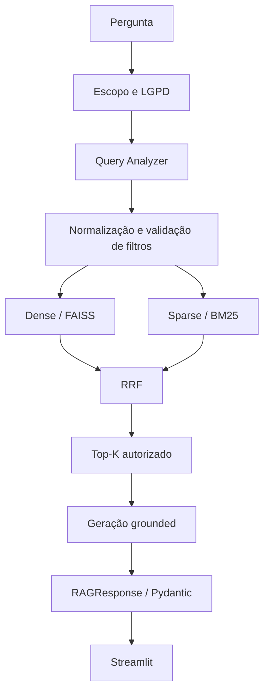

# Assistente RAG Corporativo VendeFácil

Assistente corporativo construído com Python, LangChain, FAISS e Pydantic.
O sistema consulta um corpus sintético em CSV, JSON, JSONL, Markdown, PDF e
TXT, aplica busca híbrida e devolve respostas estruturadas com evidências e
guardrails de LGPD. Não há busca externa nem resposta baseada livremente no
conhecimento paramétrico do modelo.

## Arquitetura



- Ingestão: chunking adaptativo e metadata padronizada por formato.
- Retrieval: catálogo dinâmico, filtros validados, FAISS, BM25 e RRF.
- Geração: citações construídas pelo código a partir dos chunks.
- Segurança: escopo corporativo, LGPD, mascaramento e bloqueio de chunks
  `restrito` antes da geração.
- Avaliação: checks determinísticos, rubrica oficial e RAG Triad.

## Instalação

Requisitos: Python 3.10 ou superior e uma chave da OpenAI.

```bash
python3 -m venv .venv
.venv/bin/python -m pip install -r starter/requirements.txt
cp .env.example .env
```

Configure `OPENAI_API_KEY` no arquivo `.env`. Nunca envie esse arquivo ao Git.

## Construção dos índices

```bash
.venv/bin/python -m ingestion.build.all_indexes
.venv/bin/python -m ingestion.preview.sanity_faiss
```

Os seis índices persistidos ficam em `storage/`, diretório ignorado pelo Git.
A aplicação usa `load_local` e não reindexa durante uma consulta.

## Execução

```bash
.venv/bin/python -m streamlit run app/interface_rag.py
```

Acesse `http://localhost:8501`.

Para consultar pelo terminal:

```bash
.venv/bin/python -m src.inspection.rag_pipeline \
  --query "Como realizar uma sangria no caixa?" \
  --debug
```

## Testes e benchmark

```bash
.venv/bin/python -m pytest -q
.venv/bin/python -m eval.run_benchmark --validate-only
.venv/bin/python -m eval.run_benchmark --with-judge
```

O benchmark com judge faz chamadas adicionais ao modelo e pode gerar custo.
A execução consolidada de 2026-09-04 obteve 21,0/24 pontos (87,5%), com
19 casos aprovados, 5 falhos e nenhum erro de execução.

## Política de LGPD

- **RECUSAR:** salário/remuneração individual, CPF, dados bancários, PIX,
  credenciais, tokens, senhas em logs e dados de saúde.
- **MASCARAR:** e-mail pessoal, telefone, endereço residencial e número de
  cartão.
- **RESPONDER:** dados de produto, loja, manual, política, `customer_id` e
  agregados autorizados que não criem risco de reidentificação.

Perguntas fora do escopo corporativo são recusadas. Respostas normais exigem
ao menos uma fonte com `filepath`, `chunk_id` e `quotation` literal.

## Documentação

- [Visão geral](docs/architecture/00-visao-geral.md)
- [Etapa 1 — ingestão](docs/architecture/01-ingestao.md)
- [Etapa 2 — retrieval](docs/ETAPA_2.md)
- [Etapa 3 — geração e guardrails](docs/architecture/03-generation-guardrails.md)
- [Etapa 4 — interface](docs/architecture/04-interface.md)
- [Etapa 4 — avaliação](docs/architecture/05-avaliacao.md)
- [Decisões arquiteturais](docs/architecture/DECISOES.md)
- [Debug no VS Code](docs/DEBUG_VSCODE.md)
- [Roteiro do Demo Day](docs/DEMO_DAY.md)
- [Relatório final](RELATORIO.md)

## Limitações

- O Streamlit não possui autenticação por perfil.
- O histórico visual não é memória conversacional enviada ao pipeline.
- FAISS é local e o BM25 é reconstruído em memória no bootstrap.
- Consultas de agregação global em tabelas não possuem operador dedicado.
- O corpus recebido diverge de alguns fatos do ground truth do benchmark.
