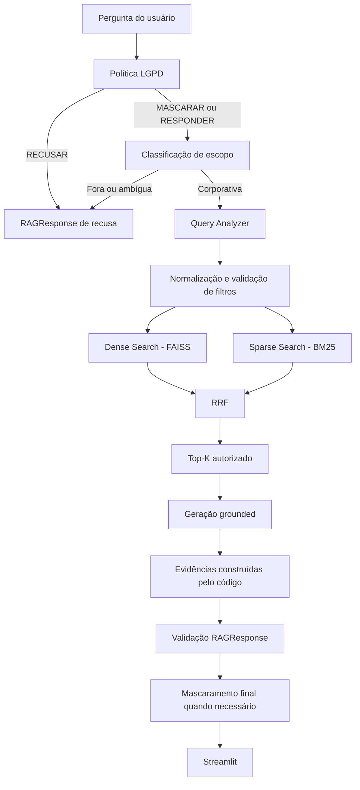

# Arquitetura geral

## Objetivo

O projeto implementa um assistente RAG corporativo para a VendeFácil. A
solução processa seis formatos, recupera contexto com busca híbrida, aplica
guardrails antes da geração e devolve uma resposta validada por Pydantic.

## Fluxo principal

## Camadas

| Camada | Responsabilidade | Diretórios principais |
| --- | --- | --- |
| Dados | Corpus sintético da VendeFácil | `data/` |
| Ingestão | Leitura, chunking e metadados | `ingestion/loaders/` |
| Indexação | Embeddings e persistência FAISS | `ingestion/build/` |
| Recuperação | Query Analyzer, Dense, BM25 e RRF | `src/retrieval/` |
| Geração | Contexto, evidências e structured output | `src/generation/` |
| Guardrails | LGPD, mascaramento e escopo | `src/guardrails/` |
| Orquestração | Ordem segura do pipeline | `src/pipeline.py` |
| Interface | Bootstrap e apresentação | `app/` |
| Avaliação | Benchmark e RAG Triad | `eval/`, `benchmark/` |
| Contrato | Schemas Pydantic da resposta | `starter/schema.py` |

## Entradas principais

- Construir os seis índices: `python -m ingestion.build.all_indexes`.
- Inspecionar a recuperação: `python -m src.inspection.hybrid_retrieval`.
- Inspecionar a Etapa 3: `python -m src.inspection.rag_pipeline`.
- Iniciar a interface: `python -m streamlit run app/interface_rag.py`.
- Validar o benchmark: `python -m eval.run_benchmark --validate-only`.
- Executar a RAG Triad: `python -m eval.run_benchmark --with-judge`.

Os exemplos pressupõem o ambiente virtual ativo. Sem ativação, use
`.venv/bin/python` no lugar de `python`.

## Estado atual

As quatro etapas estão integradas. A execução completa dos 24 casos foi
consolidada em `results/results.json`, `results/benchmark_summary.md` e no
relatório da raiz. O resultado atual é 21,0/24 pontos (87,5%), sem erros de
execução.

## Fronteiras de segurança

- A interface não consulta a internet.
- Solicitações de recusa LGPD terminam antes do retrieval.
- Apenas chunks `publico` e `interno` chegam à geração.
- O LLM seleciona somente `chunk_id`; filepath e quotation são construídos
  a partir dos `Document` recuperados.
- Logs e resultados do benchmark evitam respostas, quotations e PII completa.
