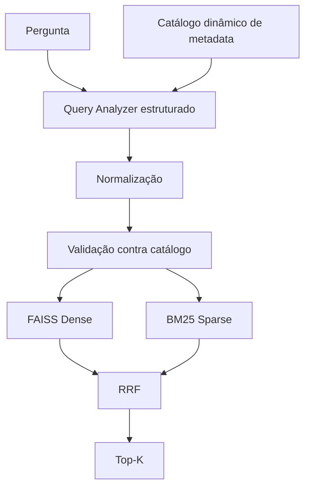

# Etapa 2 - Recuperação híbrida

## Responsabilidade

A Etapa 2 converte a pergunta em uma consulta semântica e filtros válidos,
executa buscas Dense e Sparse sobre o mesmo corpus e combina os rankings.



## Catálogo e filtros

`build_metadata_catalog(documents)` descobre os campos e valores existentes
no corpus, remove duplicatas e ordena deterministicamente. O Query Analyzer
recebe esse catálogo e produz `QueryAnalysis`, validado por Pydantic:

- `query`: consulta semântica;
- `filters`: `QueryFilters` tipado;
- `rejected_filters`: campo, valor e razão da rejeição.

A normalização remove espaços inconsistentes, trata caixa e acentos e
centraliza os nomes/siglas de estados. Um filtro só segue para os retrievers
quando campo e valor existem efetivamente no catálogo.

## Dense Search

`src/retrieval/dense.py` vetoriza a query uma vez e pesquisa os índices
FAISS. Como o FAISS do LangChain aplica filtros depois de recuperar
candidatos, a implementação escolhe explicitamente entre:

- busca sem filtro;
- pós-filtro com `fetch_k` adaptativo;
- pré-filtro exato quando a seletividade é baixa;
- pré-filtro exato de política quando há restrição de sensibilidade;
- fallback exato se o pós-filtro não preencher o `k`.

Os diagnósticos registram estratégia, total, elegíveis, seletividade e
`fetch_k`, sem registrar conteúdo dos chunks.

## Sparse Search

`BM25SparseRetriever` cria um índice em memória sobre `page_content` e campos
de identificação pesquisáveis. A tokenização normaliza caixa e acentos,
preserva padrões importantes para códigos e remove stopwords básicas.

BM25 complementa embeddings em consultas com nomes próprios, IDs, números,
códigos de erro e termos exatos.

## Fusão RRF

`reciprocal_rank_fusion` une resultados por `chunk_id` e soma a contribuição
de cada ranking:

```text
score = 1 / (rank_constant + rank)
```

O padrão de `rank_constant` é 60. O resultado guarda ranks Dense e BM25,
distância Dense, score Sparse e rank final. Correspondências exatas de IDs
podem ser fixadas no topo para evitar que um código inequívoco seja diluído.

## Orquestrador

`HybridRetriever` em `src/retrieval/pipeline.py` expõe:

```python
response = retriever.retrieve(
    question,
    allowed_sensitivities={"publico", "interno"},
)
```

`HybridRetrievalResponse` contém análise, candidatos Dense, resultados BM25
e Top-K fundido. Os padrões são `top_k=5`, `candidate_k=20`,
`dense_fetch_k=40` e podem ser configurados.

## Execução e testes

```bash
.venv/bin/python -m src.inspection.metadata_catalog
.venv/bin/python -m src.inspection.query_analyzer
.venv/bin/python -m src.inspection.hybrid_retrieval --debug
.venv/bin/python -m pytest tests/retrieval -q
```

## Limitações

- Query Analyzer e Dense Search dependem dos serviços configurados da OpenAI.
- RRF trabalha com posição, não calibra diretamente distância e score.
- O BM25 é reconstruído em memória quando o runtime é criado.
- Filtros desconhecidos são rejeitados; não existe aproximação silenciosa.
