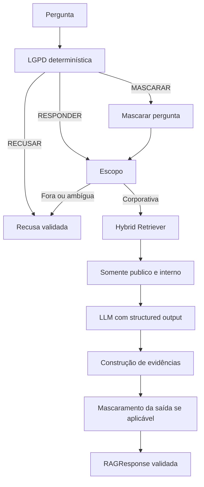

# Etapa 3 - Geração estruturada e guardrails

## Responsabilidade

A Etapa 3 impede respostas fora da política, produz respostas somente com
base no Top-K autorizado e garante um contrato Pydantic consistente.

## Ordem dos guardrails



A recusa LGPD ocorre antes de qualquer recuperação, evitando consultar ou
expor conteúdo desnecessário. A classificação de escopo vem em seguida para
impedir que o conhecimento paramétrico do modelo responda perguntas externas.

## Contrato Pydantic

O contrato oficial fica em `starter/schema.py`.

`SourceEvidence` exige:

- `filepath`;
- `chunk_id`;
- `quotation` com no máximo 500 caracteres.

`RAGResponse` exige:

- `answer`;
- `confidence_level`: `alta`, `media`, `baixa` ou `recusado`;
- `sources_used`;
- `reasoning`;
- `is_refusal`;
- `refusal_reason`: `lgpd`, `fora_de_escopo`, `sem_evidencia` ou `None`.

O `model_validator` impede combinações inconsistentes. Recusas não possuem
fontes, usam confiança `recusado` e exigem motivo. Respostas normais exigem ao
menos uma fonte e não podem possuir motivo de recusa.

## Evidências e geração

O LLM produz um `GenerationDraft` e pode selecionar apenas `chunk_id`
presentes no contexto. Ele não produz filepath nem quotation. Depois da
seleção, `build_source_evidence` recupera esses valores diretamente do
`Document`, garantindo que a quotation seja literal.

Se o modelo selecionar ID desconhecido, declarar evidência insuficiente ou
não selecionar fontes, o código devolve uma recusa `sem_evidencia`.

Structured output possui duas tentativas por padrão. Depois do limite, o
pipeline retorna falha controlada validada, sem resposta parcial.

## Política LGPD

`src/guardrails/lgpd.py` usa regras determinísticas e retorna:

- `RECUSAR`: salário individual, CPF, dados bancários, PIX, credenciais,
  tokens, senhas e saúde;
- `MASCARAR`: e-mail pessoal, telefone, endereço residencial e cartão;
- `RESPONDER`: políticas, manuais, produtos, lojas, customer_id e consultas
  sem categoria sensível reconhecida.

Agregados salariais exigem grupo conhecido com pelo menos cinco pessoas para
reduzir risco de reidentificação.

## Mascaramento

`src/guardrails/masking.py` mascara deterministicamente múltiplos e-mails,
telefones, cartões e endereços em textos maiores. O formato é parcialmente
preservado quando isso ajuda a leitura. A estratégia de endereço é
conservadora e não substitui um detector de entidades especializado.

## Escopo

Sinais corporativos explícitos de alta precisão são aceitos por regra. Os
demais casos usam LLM com `ScopeDecision` estruturada: `corporativa`,
`fora_de_escopo` ou `ambigua`. Casos fora ou ambíguos são recusados.

## Execução e testes

```bash
.venv/bin/python -m src.inspection.rag_pipeline
.venv/bin/python -m src.inspection.stage3_acceptance
.venv/bin/python -m pytest tests/generation tests/guardrails tests/integration -q
```

## Limitações

- As regras determinísticas dependem dos padrões explicitamente cobertos.
- Não existe autenticação ou autorização por perfil de usuário.
- Chunks `interno` são permitidos no ambiente corporativo; `restrito` nunca
  chega à geração.
- O histórico visual do Streamlit não é enviado ao modelo como memória.
