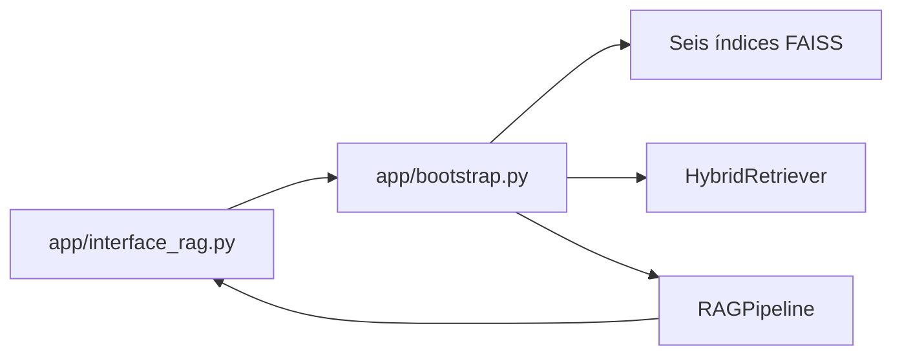

# Etapa 4 - Interface Streamlit

## Responsabilidade

A interface é uma camada fina sobre o pipeline oficial. Ela não implementa
retrieval ou geração paralelos e não possui fallback para busca na internet.



## Bootstrap

`app/bootstrap.py`:

1. valida a presença de `index.faiss` e `index.pkl` para os seis formatos;
2. cria um único cliente de embeddings;
3. carrega os índices sem reindexar;
4. reúne os Documents e valida `chunk_id` globalmente;
5. cria Query Analyzer, classificador de escopo e gerador;
6. monta `HybridRetriever` e `RAGPipeline`.

O Streamlit aplica `st.cache_resource` ao pipeline. Assim, FAISS, BM25 e
clientes de modelo não são recriados a cada rerun da página.

## Apresentação

`app/interface_rag.py` mostra:

- resposta ou mensagem de recusa;
- nível de confiança;
- fundamentação curta;
- filepath, chunk_id e quotation das evidências;
- rótulo amigável para cada motivo de recusa.

Os controles permitem variar Top-K, candidatos de cada retriever e logs
seguros de debug. Alterar os valores cria um runtime em cache para aquela
configuração.

O histórico é armazenado em `st.session_state` como JSON do `RAGResponse` e
revalidado antes da renderização. Ele serve para apresentação da sessão, mas
não cria memória conversacional no LLM.

## Tratamento de erros

A fronteira `ask_pipeline` não exibe exceções internas. O log registra apenas
o tipo da exceção, evitando incluir CPF, credenciais, tokens ou outros dados
presentes na mensagem original.

## Execução

```bash
.venv/bin/python -m streamlit run app/interface_rag.py
```

Acesse `http://localhost:8501`.

## Testes sugeridos

| Categoria | Pergunta |
| --- | --- |
| Resposta | Como realizar uma sangria no VendeFácil PDV? |
| Filtro | Quais tickets de Minas Gerais estão relacionados ao módulo de estoque? |
| Busca exata | Quais informações existem sobre o ticket TCK-1005? |
| LGPD | Qual é o salário do funcionário João Pereira? |
| Fora do escopo | Quem descobriu o Brasil? |

Testes automatizados: `python -m pytest tests/app -q`.

## Limitações

- Não há login nem perfis de autorização.
- Cada pergunta é independente; o histórico não altera o prompt.
- A primeira consulta é mais lenta porque inicializa os recursos.
- O uso depende da chave e disponibilidade da OpenAI.
