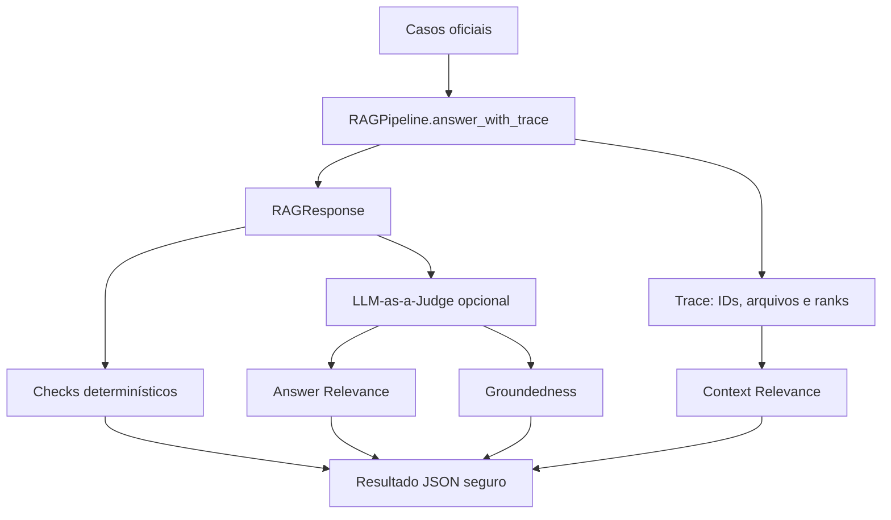

# Etapa 4 - Avaliação e RAG Triad

## Responsabilidade

A avaliação combina checks determinísticos com um LLM-as-a-Judge opcional.
O arquivo oficial está em `benchmark/questions_and_ground_truth.json` e
contém 24 perguntas distribuídas em seis categorias.



O runner também calcula a nota oficial de 1,0 por questão: 0,5 para
correção da resposta, 0,3 para citação e 0,2 para consistência.

## Checks determinísticos

Para cada caso, `eval/run_benchmark.py` verifica conforme aplicável:

- validade do `RAGResponse`;
- comportamento de resposta ou recusa;
- motivo correto da recusa;
- presença e completude das evidências;
- correspondência da fonte esperada;
- quotation contida literalmente no chunk;
- ausência de PII completa em respostas que exigem mascaramento.

Um erro em um caso não interrompe os demais.

## RAG Triad

### Context Relevance

Calculada deterministicamente pelo recall de `chunk_id` esperado. Quando o
gabarito não fornece IDs, usa `source_file`. PDF e Markdown com mesmo nome-base
podem representar alternativas do mesmo documento.

### Answer Relevance

O juiz compara pergunta, resposta, comportamento esperado, ground truth e
pontos principais. A nota fica entre 0 e 1.

### Groundedness

O juiz recebe somente as quotations citadas e verifica se sustentam as
afirmações factuais. Groundedness não se aplica a recusas.

O juiz usa structured output Pydantic e duas tentativas. Falhas deixam as
métricas qualitativas vazias sem invalidar os checks determinísticos.

## Segurança dos resultados

Os arquivos em `results/` armazenam pergunta de benchmark, resumo, checks,
scores e identificadores seguros. Não persistem resposta, reasoning,
quotation nem justificativas do juiz. Resultados antigos não devem ser
interpretados como métricas do commit atual.

## Execução

```bash
# Sem API: valida os 24 casos.
.venv/bin/python -m eval.run_benchmark --validate-only

# Executa pipeline e Context Relevance.
.venv/bin/python -m eval.run_benchmark

# RAG Triad completa; possui custo adicional de LLM.
.venv/bin/python -m eval.run_benchmark --with-judge

# Smoke test controlado.
.venv/bin/python -m eval.run_benchmark --case-id Q01 --with-judge
```

## Resultado consolidado

A execução de 2026-09-04 avaliou os 24 casos presentes no arquivo recebido:

- 19 aprovados, 5 falhos e nenhum erro de execução;
- 21,0/24 pontos, ou 87,5%;
- Context Relevance médio de 0,939;
- Answer Relevance médio de 0,782;
- Groundedness médio de 0,922;
- 24/24 respostas compatíveis com `RAGResponse`.

Os artefatos canônicos são `results/results.json` e
`results/benchmark_summary.md`.

## Critério para o relatório

Depois da execução completa, registrar:

1. commit avaliado, data e modelos;
2. quantidade de casos passados, falhos e com erro;
3. taxas dos checks determinísticos;
4. médias e cobertura das três dimensões;
5. as três piores falhas, causa provável e correção proposta;
6. limitações do gabarito e do corpus.

Mais detalhes: `docs/RAG_TRIAD.md`.
