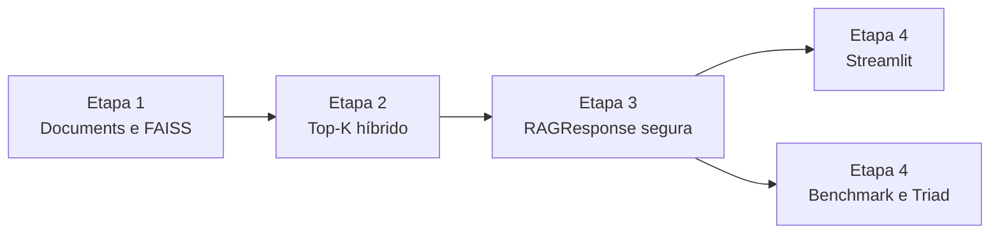

# Integração final

## Dependências entre etapas



Cada etapa possui uma fronteira verificável:

| Etapa | Entrada | Saída |
| --- | --- | --- |
| 1 | Arquivos do corpus | `Document` e índices persistidos |
| 2 | Pergunta e Documents | `HybridRetrievalResponse` |
| 3 | Pergunta e Top-K | `RAGResponse` |
| 4 | Perguntas do usuário ou benchmark | UI e métricas |

## Inicialização do runtime

`app/bootstrap.py` é a composition root da aplicação. Ele conhece detalhes
de criação dos clientes e índices; os componentes de domínio recebem essas
dependências por construtor e permanecem testáveis com fakes.

```text
build_rag_pipeline
  -> valida INDEX_PATHS
  -> create_openai_embeddings
  -> load_faiss_index x 6
  -> documents_from_indexes
  -> HybridRetriever
       -> catálogo de metadata
       -> BM25 em memória
       -> Query Analyzer
  -> RAGPipeline
       -> Scope model
       -> Generation model
```

## Preparação do ambiente

```bash
python3 -m venv .venv
.venv/bin/python -m pip install -r starter/requirements.txt
cp .env.example .env
```

Preencha `OPENAI_API_KEY` no `.env`. Os modelos possuem valores padrão, mas
podem ser configurados separadamente para embeddings, Query Analyzer, escopo,
geração e juiz.

## Sequência de validação

```bash
# 1. Suíte offline.
.venv/bin/python -m pytest -q

# 2. Conferir os índices locais.
.venv/bin/python -m ingestion.preview.sanity_faiss

# 3. Testar retrieval.
.venv/bin/python -m src.inspection.hybrid_retrieval

# 4. Testar resposta estruturada e guardrails.
.venv/bin/python -m src.inspection.stage3_acceptance

# 5. Testar a interface.
.venv/bin/python -m streamlit run app/interface_rag.py

# 6. Validar e executar benchmark.
.venv/bin/python -m eval.run_benchmark --validate-only
.venv/bin/python -m eval.run_benchmark --with-judge
```

## Checklist de entrega

- [x] Seis loaders com chunking adaptativo.
- [x] Metadata obrigatória e `chunk_id` estável.
- [x] Seis índices FAISS persistidos e recarregáveis.
- [x] Dense + BM25 + RRF com filtros validados.
- [x] Resposta Pydantic com evidência literal.
- [x] LGPD, mascaramento e fora de escopo.
- [x] Interface conectada ao pipeline oficial.
- [x] Benchmark de 24 perguntas e RAG Triad implementados.
- [x] Benchmark completo executado na working tree final.
- [x] Métricas e três piores falhas registradas no relatório.
- [x] Perguntas do Demo Day selecionadas e testadas.
- [ ] Apresentação ensaiada pela dupla com cronômetro.

## Observabilidade segura

Logs opcionais podem conter decisão LGPD, classificação de escopo, IDs de
chunks, quantidade de fontes, confiança e motivo de recusa. Não devem conter
CPF, salário individual, token, senha, dados bancários, PIX ou PII completa.

## Limitações para produção

- FAISS local e BM25 em memória não resolvem concorrência ou escala horizontal.
- Não há autenticação, RBAC, auditoria persistente ou gestão de segredos.
- O arquivo pickle deve ser produzido e consumido em ambiente confiável.
- Dependências `langchain-community` emitem aviso de descontinuação e devem
  ser migradas antes de uso de longo prazo.
